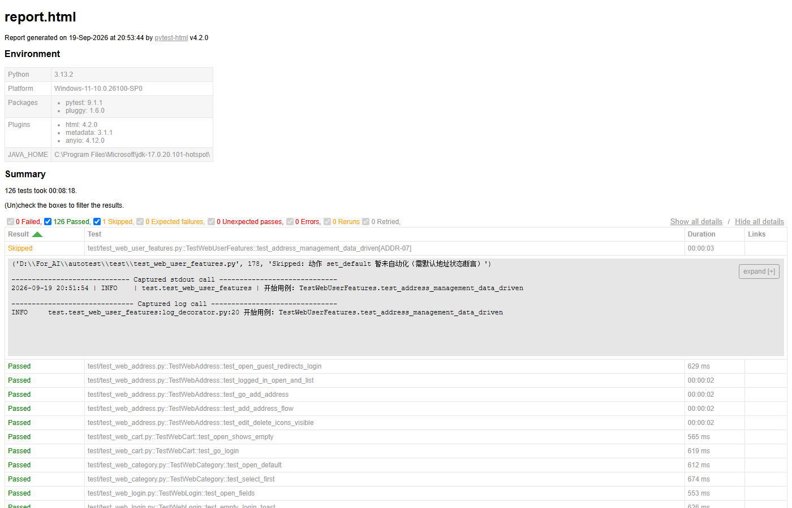

# Mall H5 商城 Web 自动化测试框架

基于 **pytest + Playwright + Page Object + Excel 数据驱动** 的 H5 商城端到端测试项目。
对齐真实 uni-app 商城（Mall）业务，覆盖 **搜索 / 登录注册 / 商品与 SKU / 购物车 / 下单结算 / 收藏 / 足迹 / 收货地址 / 会员中心** 全链路。

- 用例规模：**127 条**（12 个测试模块 / 14 个 Page Object / 20 个数据 sheet）
- 最近全量 E2E：**126 passed, 1 skipped**（真实浏览器，约 9 分钟）
- 数据与断言口径均来自 **线上实测**（含促销价、真实 toast、真实跳转）



## 技术栈

| 方向 | 选型 |
| --- | --- |
| 语言 / 断言 | Python 3.13、pytest 8 |
| Web E2E | Playwright（Chromium，同步 API，自动等待） |
| App E2E（预留） | Appium-Python-Client |
| 数据驱动 | openpyxl（Excel 20 sheet 单一数据源） |
| 配置管理 | YAML + 环境变量覆盖（`config/config.yaml`） |
| 报告 / 日志 | pytest-html（失败截图 base64 内嵌）+ 统一 logger |

## 覆盖范围（127 条）

| 模块 | 用例数 | 覆盖点 |
| --- | --- | --- |
| `test_web_search.py` | 19 | 关键词跳列表/空态/历史/DB-ES 差异（数据驱动 KW-01~18） |
| `test_web_login.py` | 4 | 字段/空提交 toast/去注册/体验账号 |
| `test_web_register.py` | 4 | 表单/空提交/二维码/注册成功（拦截接口取验证码） |
| `test_web_main.py` | 3 | 首页楼层数量/搜索入口/购物车 tab |
| `test_web_category.py` | 2 | 一级分类 6 项/切换二级联动 |
| `test_web_cart.py` | 2 | 未登录空态/去登录 |
| `test_web_product.py` | 9 | 详情元素/未登录收藏加购拦截/登录态收藏加购链路 |
| `test_web_product_workflow.py` | 20 | 浏览→足迹、收藏→收藏夹、关注、加购→购物车、立即购买（4 商品参数化） |
| `test_web_address.py` | 5 | 地址列表/新增/编辑删除图标 |
| `test_web_user.py` | 2 | 游客态/订单与菜单 |
| `test_web_user_features.py` | 42 | 我的页功能入口、地址管理 12 组（校验/编辑/删除/取消）、会员资产联动 12 组 |
| `test_web_multi_product.py` | 15 | **多商品业务流**：多商品加购/同SKU合并/删单条/数量步进/勾选重算/清空/去结算、多商品收藏与取消、收藏跳详情、多商品足迹、SKU 价格联动 |

## 测试数据设计（`date/search_testdata.xlsx`，20 sheet）

| 分类 | Sheet | 说明 |
| --- | --- | --- |
| 搜索 | 搜索关键词（KW-01~18）、搜索历史状态（HIST-01~05） | H5 条数用 DB 列；`H5否/ES是`走差异用例 |
| 商品 | 商品基准（14 行，含 26/27/37/44）、SKU 基准（8 行） | 搜索断言、加购 SKU、规格/价格联动基准 |
| 购物车/下单 | 加购下单组合（CO-01~08）、购物车联动（CART-01~09）、多商品业务流（MIX-01~15） | 合法/边界/异常组合，多商品场景 |
| 会员 | 收货地址管理（ADDR-01~12）、会员资产联动（ASSET-01~12）、我的页功能（USER-01~10） | 校验 toast、资产联动、功能入口 |
| 商品详情 | 商品详情页（DET-01~12）、页面 UI 基准（27 行） | 详情动作 + 各 Page 硬编码断言对照 |
| 接口层 | 后台登录、前台登录注册、收货地址、优惠券、订单状态、后台商品管理、权限隔离 | HTTP + 业务 code 双断言期望（接口用例可直接接入） |
| 说明 | 说明 | 列口径、数据有效期、实测缺陷与前端行为记录（24 条） |

读取方式：

```python
from date import load_product_base, load_mix_cases, load_address_mgmt_cases
# 或 openpyxl.load_workbook(SEARCH_DATA_XLSX, data_only=True)
```

## 用例设计方法

数据驱动用例按 testcase-generator 设计方法标注（Excel `design_method`、`priority` 列）：

- **ST 场景法**：多步骤业务基本流/备选流（加购→结算、收藏→取消→列表核对）
- **BS 业务状态**：SKU 价格联动、勾选/未勾选总价重算、收藏/取消收藏态
- **BVA 边界值**：数量步进器 ±1、同 SKU 合并数量
- **EG 错误推测**：同商品重复加购、非法 SKU、空关键词/纯空格/单字母
- **RL 关联关系**：指定 SKU 加购后规格/价格匹配、收藏卡片→详情 id 关联
- 优先级 P0（冒烟）/P1（核心回归）/P2（全量回归）落表管理

## 目录结构

```text
autotest/
├── README.md
├── pytest.ini                  # testpaths / markers / HTML报告 / 日志格式
├── conftest.py                 # config/pw_page/app_driver fixture；失败自动截图并内嵌报告
├── requirements.txt
├── config/
│   ├── config.yaml             # web.base_url（默认 localhost）、API、Appium
│   └── settings.py             # 配置加载 + 环境变量覆盖
├── common/
│   ├── base_web_page.py        # Web BasePage：导航/查找/操作/等待/截图/元素快照
│   ├── base_app_page.py        # App BasePage（预留骨架）
│   ├── logger.py               # 控制台 + 文件双输出，单例复用
│   └── log_decorator.py        # @log_class 自动记录用例结果与耗时
├── date/
│   ├── __init__.py             # sheet 常量 + load_*_cases() 加载器
│   └── search_testdata.xlsx    # 唯一数据源（20 sheet）
├── pages/web/                  # 14 个 Page Object
├── test/                       # 12 个测试模块（127 条）
└── docs/images/report.png      # 报告示意（README 展示用）
```

## 快速开始

```bash
pip install -r requirements.txt
python -m playwright install chromium

# 1）默认模式：不启动浏览器，仅采集/数据校验
python -m pytest test --collect-only -q

# 2）真实 E2E（需先启动被测 H5：默认 http://localhost/app/#）
set PLAYWRIGHT_E2E=1            # Windows；Linux/Mac: export PLAYWRIGHT_E2E=1
python -m pytest test -m "web and e2e"

# 3）只跑某模块 / 某条
python -m pytest test/test_web_multi_product.py -q
python -m pytest test -q -k "MIX-08"

# 4）切换被测地址（不改文件）
set WEB_BASE_URL=https://staging.example.com/app/#
```

- 报告：`reports/report.html`（self-contained，失败截图已内嵌）
- 日志：`logs/autotest.log` + 控制台（每条用例含耗时与结果）
- 演示账号：被测库使用 `test / 123456`（仅本地演示环境）

## 框架能力

- **Page Object 分层**：14 个 PO 只暴露业务动作（`search() / add_to_cart(specs) / go_settle() / toggle_collect()`），断言全部留在用例层。
- **数据驱动**：所有业务用例读 Excel，改数据不改代码；Sheet 名常量化，避免中文硬编码散落。
- **E2E 环境门控**：`PLAYWRIGHT_E2E / APPIUM_E2E` 未开启时自动 skip，CI 默认零依赖采集。
- **失败自动截图**：hook 捕获失败用例，截图存 `reports/shots/` 并 base64 内嵌 HTML，单文件报告可离线查看。
- **元素快照辅助定位**：`BaseWebPage.snapshot_elements() / dump_for_pom()` 一键导出当前页可交互元素与推荐选择器，用于快速编写/校准 PO。
- **统一日志装饰器**：`@log_class` 输出用例开始/通过/失败与耗时，便于回归分析。

## 测试中发现的问题（实测记录，详见 Excel `说明` sheet）

1. 加购/下单接口不校验数量与库存：0 件、负数、超库存（487）全部返回成功（`CO-02/03`）。
2. 非法 SKU 加购成功，确认订单接口 HTTP 500（`CO-05`）。
3. 品牌可重名创建（无唯一校验，`PM-05`）。
4. 过期优惠券可领取、重复领取不幂等（`CP-02/03`）。
5. 地址后端无校验：非法手机号/空姓名均成功，仅靠前端 toast 拦（`AD-02/03`）。
6. 前端“立即购买”未开放，仅 toast 提示“暂时只支持从购物车下单”。
7. 前端“退款/售后”订单入口点击无响应（未实现）。
8. H5 缺陷：从“我的页”SPA 进入足迹/收藏后，头部「清空」按钮事件被派发到页面栈上一页（实测跳设置页）。
9. 前端体验：地址新增/编辑/删除成功均无 toast；收藏/足迹列表无单条删除（仅支持清空）；品牌区无关注按钮。

## 工程实践记录（调试坑位）

- **同路由 hash 跳转不重渲染**：商品 A→B 内容不更新、足迹不上报 → PO 内 `goto + reload` 解决。
- **uni-modal 确认按钮类名为 `__btn_primary`**：`.confirm-btn` 不存在；`text=确定` 会命中文案+按钮两处。
- **列表异步加载竞态**：地址/购物车/足迹/收藏计数需等渲染；购物车存在“先渲染清空按钮再切空态”的过渡态。
- **购物车列表顺序不稳定**：多商品断言改为按商品名动态定位行号。
- **促销价口径**：H5 展示促销价（如 26 商品 16G=3699、32G=3899），与 DB 原价（3788/3999）不同，金额断言以页面实测为准。

## 已知限制 / Roadmap

- App 用例未接入（`base_app_page.py` 与 `app_driver` 为预留骨架）。
- `ADDR-07 设为默认地址` 需“默认地址状态”断言，暂 skip 留作补充。
- 接口层期望（HTTP + code）已在 Excel 备好，可扩展 API 用例。
- 可扩展：GitHub Actions（Playwright 缓存 + 定时 E2E）、Allure 报告、用例标签化回归集。

